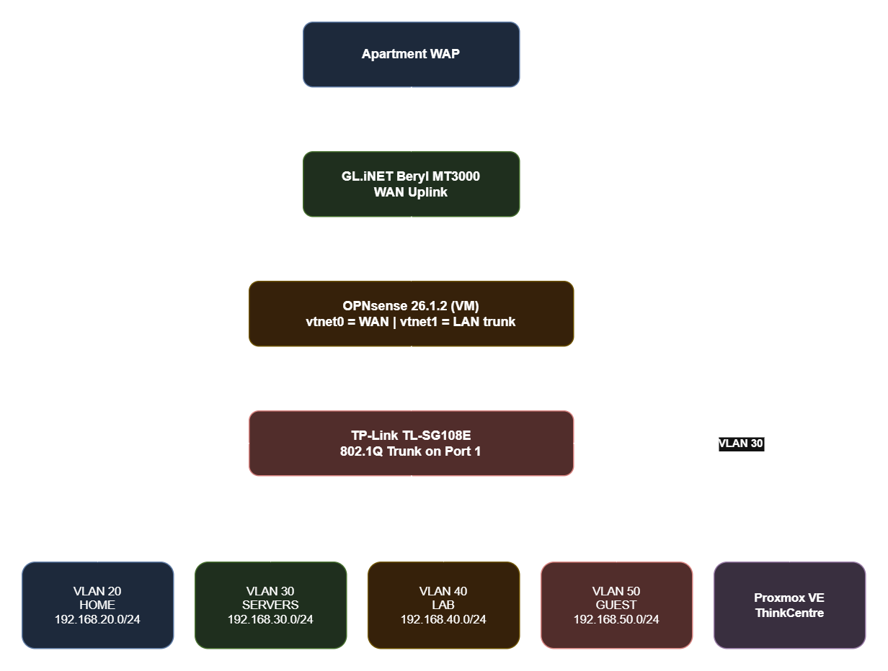

# Lab 01 - Proxmox + OPNsense + VLAN segmentation

## Overview

This was my first real networking lab build. The goal was to take a ThinkCentre running Proxmox and turn it into a properly segmented home lab with a real firewall, isolated VLANs, and a foundation I could build on. I also had to undo a significant amount of damage from a previous misconfiguration, so this lab covers both the build and the recovery.

One additional constraint: I live in an apartment complex and have no access to the upstream ISP router, only a wireless access point. This meant OPNsense could not be directly connected to a modem. Instead, the GL.iNET Beryl acts as a Wi-Fi client bridge, connecting to the apartment WAP and feeding a wired WAN connection into OPNsense.

**Time to complete:** Approximately two days across multiple sessions. 
This includes recovering from a prior misconfiguration, a clean 
OPNsense reinstall, and full VLAN configuration from scratch.

## Objectives

- Deploy OPNsense as a virtualized firewall on Proxmox
- Design and implement a segmented network using 802.1Q VLANs
- Isolate lab traffic from personal and server traffic
- Configure inter-VLAN routing with explicit firewall rules
- Establish a stable foundation for future SIEM and IDS deployment

## Threat Model

Every design decision here was made with a specific threat in mind:

**Lab Isolation** - VLAN 40 hosts intentionally vulnerable machines. A compromised lab VM should have zero lateral movement path to personal devices or server infrastructure. Hard block enforced at the firewall.

**Hypervisor Protection** - Proxmox is the foundation everything runs on. It lives on VLAN 30 and is only reachable from VLAN 20 on specific ports. No other VLAN can touch it.

**Guest Isolation** - Untrusted devices get internet access only. No visibility into any other VLAN.

**Untrusted WAN** - The apartment network is treated as untrusted WAN. OPNsense sits behind the Beryl which provides a NAT boundary between the apartment network and the lab.

## Architecture



### NIC to Bridge Mapping

| Physical NIC | Proxmox Bridge | Role | 
|--------------|----------------|------|
| NIC0 | vmbr0 | Proxmox management (VLAN 30) | 
| NIC1 | vmbr1 | OPNsense WAN (from Beryl) |
| NIC2 | vmbr2 | OPNsense LAN trunk (to switch) |

### VLAN Design
| VLAN | Name | Subnet | Purpose |
|------|------|--------|---------|
| 20 | HOME | 192.168.20.0/24 | Primary devices | 
| 30 | SERVERS | 192.168.30.0/24 | Proxmox, future NAS |
| 40 | LAB | 192.168.40.0/24 | Isolated practice environment |
| 50 | GUEST | 192.168.50.0/24 | Untrusted devices |

## Technical Detail

### Proxmox Network Config

```bash
auto vmbr0
iface vmbro inet static
        address 192.168.30.10/24
        gateway 192.168.30.1
        bridge-ports nic0
        bridge-stp off
        bridge-fd 0

auto vmbr1
iface vmbr1 inet manual
        bridge-ports nic1
        bridge-stp off
        bridge-fd 0
#WAN Bridge

auto vmbr2
iface vmbr2 inet manual
        bridge-ports nic2
        bridge-stp off
        bridge-fd 0
#LAN Bridge
```

### OPNsense VM Specs

| Setting | Value |
|---------|-------|
| Version | 26.1.2 |
| RAM | 2GB |
| Disk | 32GB ZFS (MBR) |
| BIOS | SeaBIOS |
| net0 | vmbr1 (WAN) |
| net1 | vmbr2 (LAN trunk) |

### Interface Assignments

| Interface | Device | IP |
|-----------|--------|----|
| WAN | vtnet0 | DHCP from Beryl (192.168.8.x) |
| LAN | vtnet1 | 192.168.1.1/24 |
| HOME | vlan01 | 192.168.20.1/24 |
| SERVERS | vlan02 | 192.168.30.1/24 |
| LAB | vlan03 | 192.168.40.1/24 |
| GUEST | vlan04 | 192.168.50.1/24 |

### Firewall Rules

OPNsense processes rules inbound on each interface. Rules are evaluated 
top to bottom. An implicit deny all exists at the bottom of every ruleset.

**HOME (VLAN 20):**
| Action | Source | Destination | Purpose |
|--------|--------|-------------|---------|
| Pass | HOME net | any | Internet access |
| Pass | HOME net | 192.168.30.0/24 | Access to servers |
| Block | HOME net | 192.168.40.0/24 | No access to lab |

**SERVERS (VLAN 30):**
| Action | Source | Destination | Purpose |
|--------|--------|-------------|---------|
| Pass | SERVERS net | any | Internet access |
| Block | SERVERS net | 192.168.40.0/24 | No access to lab |

**LAB (VLAN 40):**
| Action | Source | Destination | Purpose |
|--------|--------|-------------|---------|
| Block | LAB net | 192.168.20.0/24 | No access to home |
| Block | LAB net | 192.168.30.0/24 | No access to servers |
| Block | LAB net | 192.168.50.0/24 | No access to guest |
| Pass | LAB net | any | Internet access |

**GUEST (VLAN 50):**
| Action | Source | Destination | Purpose |
|--------|--------|-------------|---------|
| Block | GUEST net | 192.168.20.0/24 | No access to home |
| Block | GUEST net | 192.168.30.0/24 | No access to servers |
| Block | GUEST net | 192.168.40.0/24 | No access to lab |
| Pass | GUEST net | any | Internet access |

### Switch Configuration

| VLAN | Port 1 | Port 2 | Port 3 | Ports 4-8 |
|------|--------|--------|--------|-----------|
| 1 | Tagged | - | - | Untagged |
| 20 HOME | Tagged | Untagged | - | - |
| 30 SERVERS | Tagged | - | Untagged | - |
| 40 LAB | Tagged | - | - | - |
| 50 GUEST | Tagged | - | - | - |

| Port | PVID | Device |
|------|------|--------|
| 1 | 1 | NIC2 (OPNsense LAN trunk) |
| 2 | 20 | Main PC |
| 3 | 30 | NIC0 (Proxmox management) |
| 4-8 | 1 | Unassigned |

## Challenges and Troubleshooting

**OPNsense partition destroy error** - The UFS installer failed with "Partition destroy failed" across multiple 
disk bus types and wipe attempts. Root cause was never fully identified. 
ZFS with MBR partitioning resolved it.

**UEFI boot loop** - ZFS/UEFI installed successfully but would not boot. Switching to SeaBIOS 
with MBR resolved it.

**Dnsmasq and Kea DHCP conflict** - Both services ran simultaneously after setup. Kea was not handing out 
leases because Dnsmasq was intercepting DHCP requests first. Fixed by 
disabling DHCP in Dnsmasq.

**Switch losing connectivity mid-config** - Modifying VLAN 1 while connected through it caused repeated lockouts. 
Fix: add new VLANs and set PVIDs before touching VLAN 1.

**bridge-vlan-aware broke routing** - Adding bridge-vlan-aware to vmbr2 broke OPNsense traffic flow entirely. 
Reverted and resolved with a full Proxmox reboot.

**Recovery procedure** - When locked out remotely: plug keyboard and mouse directly into 
ThinkCentre, run `qm start 100` to restart OPNsense, set static IP 
`192.168.30.50/24` on PC to reach Proxmox at `192.168.30.10:8006`.

## Lessons Learned

- Map physical NICs to bridges before touching any VM config
- OPNsense firewall rules are inbound only. Meaning block rules go on the 
source VLAN interface, not the destination
- Kea DHCP requires a subnet defined for every interface it listens 
on. Meaning adding the interface alone is not enough
- Set switch PVIDs immediately after adding each VLAN to avoid losing 
management connectivity
- Never modify the bridge config OPNsense is actively using without 
a physical recovery path ready
- Always have keyboard and mouse access to the hypervisor when making 
network changes

## What's Next

- Proxmox SDN configuration for true per-VM VLAN isolation
- NAS deployment on VLAN 30
- Wazuh SIEM deployment
- Suricata or Zeek on a dedicated monitoring interface
- Active Directory domain on VLAN 40
